## Descarga la imagen 'httpd' y comprueba que está en tu equipo.

## Crea un contenedor con el nombre 'asir_httpd'.

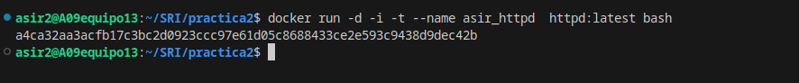

## Mapea el puerto 80 del contenedor con el puerto 8000 de tu máquina.

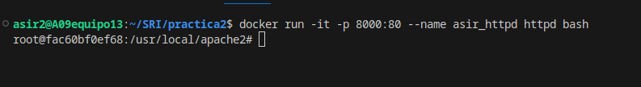

## Utiliza bind mount para que el directorio del apache2 'htdocs' este montado un directorio que tu elijas.

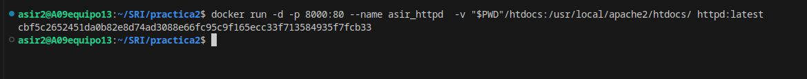

## Realiza un 'hola mundo' en html y comprueba que accedes desde el navegador.

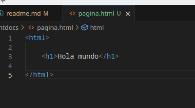

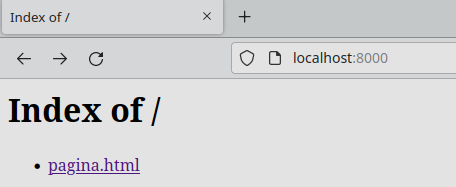

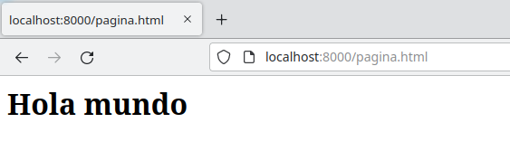

## Crea un contenedor 'asir_web1' que use este mismo directorio para 'htdocs' y el puerto 8000

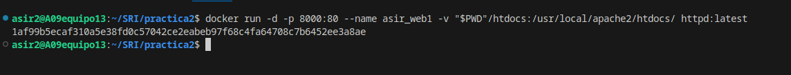

## Utiliza Code para hacer un hola mundo en html

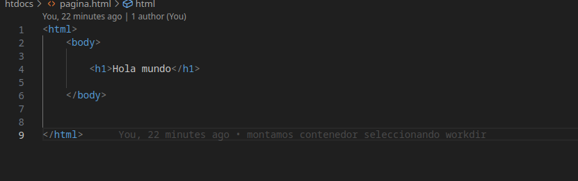

## Crea otro contenedor 'asir_web2' con el mismo directorio y a otro puerto, por ejemplo 9080.

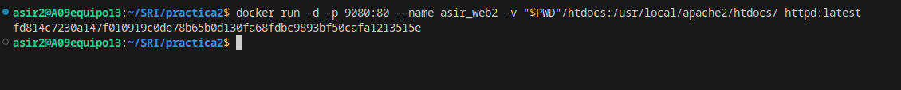

## Comprueba que los dos servidores 'sirven' la misma página, es decir, cuando consultamos en el navegador:

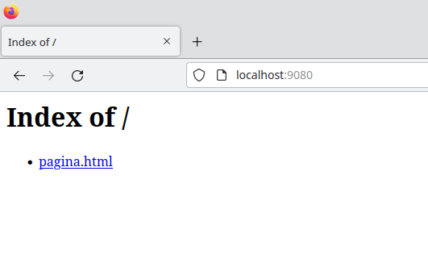

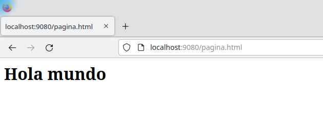

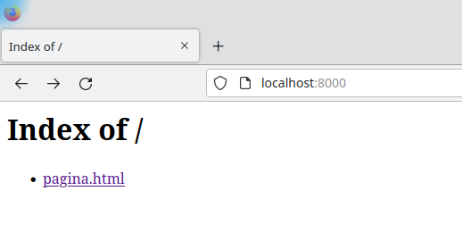

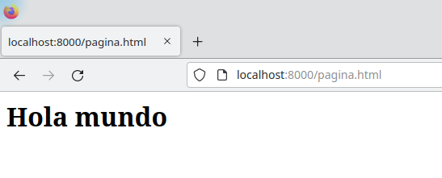