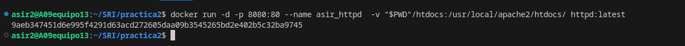

## Descarga la imagen 'httpd' y comprueba que está en tu equipo.

## Crea un contenedor con el nombre 'asir_httpd'.

## Mapea el puerto 80 del contenedor con el puerto 8000 de tu máquina.

## Utiliza bind mount para que el directorio del apache2 'htdocs' este montado un directorio que tu elijas.

